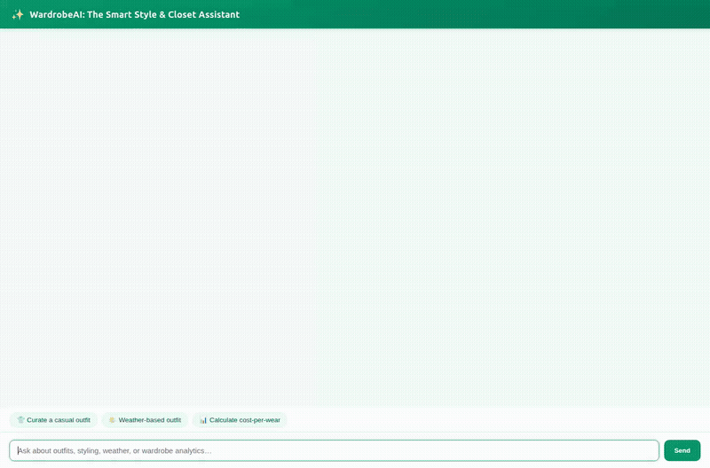

# WardrobeAI: The Smart Style & Closet Assistant



**WardrobeAI** is an agentic AI assistant built with Google Agent Development Kit (ADK) and Gemini on Google Cloud Vertex AI Agent Platform. It serves as an expert personal styling and wardrobe management companion, offering personalized outfit curation, catalog inventory search, item inspection, apparel image generation, dynamic video showcase generation, code sandbox analytics, and cross-session memory.

---

## What the Agent Actually Does

Based on the implemented tools in [`app/`](app/):

1. **Cross-Session Long-Term Memory (Vertex AI Memory Bank)**
   - Wires `PreloadMemoryTool()` to recall previous styling preferences, clothing sizes, favorite brands, past logged outfits, and sensitive fabric/material allergies.
   - Saves conversations to the managed Memory Bank after each turn via `generate_memories_callback`.

2. **Wardrobe Inventory & Catalog Management (Cloud Firestore)**
   - `search_wardrobe_catalog`: Searches the user's wardrobe items in Firestore by category (`tops`, `bottoms`, `outerwear`, `shoes`, `accessories`), season, style, color, or keyword.
   - `list_wardrobe_items`: Retrieves all items in the wardrobe inventory with an optional item count limit.
   - `get_wardrobe_item`: Inspects a specific garment by ID, retrieving brand, material, size, care instructions, and purchase price.
   - `add_wardrobe_item`: Inserts new apparel pieces into the user's Firestore wardrobe collection.

3. **High-Resolution Apparel Image Generation (Vertex AI Imagen / Flash-Lite)**
   - `generate_wardrobe_item_image`: Generates visual renderings or moodboards for clothing pieces and outfit combinations using `gemini-3.1-flash-lite-image` in the global region.
   - Saves image bytes as an ADK artifact via `tool_context.save_artifact` (visible in Playground) and uploads them to a public Google Cloud Storage bucket, returning a permanent HTTPS URL.

4. **Dynamic Video Generation (Google Omni Model)**
   - `generate_wardrobe_item_video`: Generates short video showcases (e.g., garments fluttering, studio mannequin rotation) using Google's `gemini-omni-flash-preview` model in the global region.
   - Saves video bytes as an ADK artifact (`tool_context.save_artifact`) and uploads them to Cloud Storage, returning a public HTTPS URL.

5. **Wardrobe Analytics & Cost-Per-Wear (Agent Engine Code Sandbox)**
   - Executes Python code in a secure Vertex AI Agent Engine sandbox environment (`AgentEngineSandboxCodeExecutor`) to calculate cost-per-wear formulas, wardrobe budget breakdowns, and garment utilization metrics.

6. **Contextual Tools (Weather & Time)**
   - `get_weather`: Checks current conditions to recommend weather-appropriate fabrics and layering.
   - `get_current_time`: Retrieves current local timestamps for scheduling and time-sensitive outfit planning.

7. **Rich Conversational UI (A2UI & FastAPI Web Proxy)**
   - Returns structured A2UI display cards (cards, columns, rows, images, and text hints) rendered natively in the frontend.
   - FastAPI proxy translates browser chat calls into Agent-to-Agent (A2A) protocol calls over the deployed Agent Runtime.

*(Note: Real-time third-party store purchase checkout and physical barcode scanning mentioned in exploratory ideation are planned, not yet implemented).*

---

## Project Structure

```
├── app/
│   ├── agent.py            # Main ADK Agent definition, system instructions, and tool bindings
│   ├── firestore_tools.py  # Firestore catalog search, item inspection, and wardrobe insertion
│   ├── image_tools.py      # Vertex AI image generation and GCS upload
│   ├── video_tools.py      # Vertex AI Omni video generation and GCS upload
│   ├── a2ui_utils.py       # A2UI response formatting callback
│   └── fast_api_app.py     # Local FastAPI ASGI wrapper
├── frontend/
│   ├── main.py             # FastAPI A2A proxy server
│   ├── Dockerfile          # Container configuration for Cloud Run
│   └── static/
│       └── index.html      # Styled chat interface with example prompt pills and A2UI renderer
├── demo/
│   ├── demo.gif            # Looping demonstration of wardrobe outfit curation and image generation
│   ├── record_demo.py      # Playwright browser automation script for recording demos
│   └── wardrobe_ai_demo.mp4# Full HD video demo with synthesized lo-fi music track
├── agents-cli-manifest.yaml # Agent Platform deployment configuration
└── pyproject.toml          # Python dependencies (google-adk, google-genai, sse-starlette)
```

---

## Setup & Running Locally

### 1. Prerequisites
- Python 3.11 or 3.12
- Google Cloud SDK (`gcloud`) authenticated to your GCP project
- Application Default Credentials (ADC) configured:
  ```bash
  gcloud auth application-default login
  ```

### 2. Install Dependencies
```bash
python3 -m venv .venv
source .venv/bin/activate
pip install -e .
```

### 3. Run the Agent Locally (ADK Web)
To test the agent with the built-in ADK developer UI:
```bash
adk web app
```

### 4. Run the Custom Frontend Locally
To run the branded chat frontend with the FastAPI A2A proxy:
```bash
cd frontend
python3 -m venv .venv
source .venv/bin/activate
pip install -r requirements.txt

# Set your Agent Runtime resource name and directory
export AGENT_ENGINE_RESOURCE_NAME="projects/<PROJECT_NUMBER>/locations/us-east1/reasoningEngines/<ENGINE_ID>"
export AGENT_DIRECTORY="app"
export PORT="8080"

python main.py
```
Open a browser and navigate to the local server port configured above.

---

## Deployment Instructions

### Deploy the Agent to Vertex AI Agent Platform
```bash
agents-cli deploy \
  --project <GCP_PROJECT_ID> \
  --region us-east1 \
  --deployment-target agent_runtime \
  --no-confirm-project
```

### Deploy the Frontend to Cloud Run
```bash
cd frontend
gcloud run deploy wardrobe-stylist-frontend \
  --source . \
  --project <GCP_PROJECT_ID> \
  --region us-east1 \
  --set-env-vars AGENT_ENGINE_RESOURCE_NAME="projects/<PROJECT_NUMBER>/locations/us-east1/reasoningEngines/<ENGINE_ID>",AGENT_DIRECTORY="app" \
  --allow-unauthenticated
```
